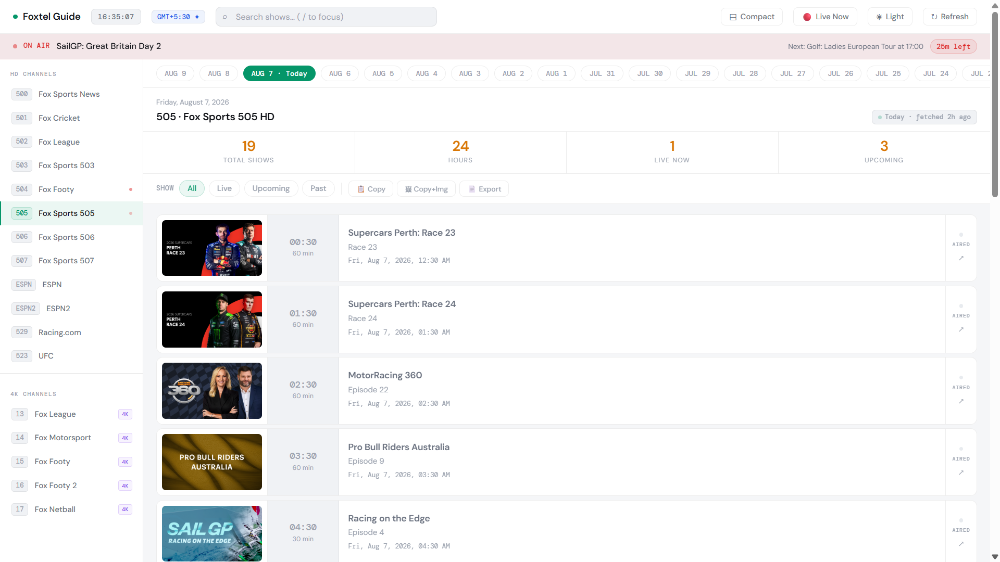
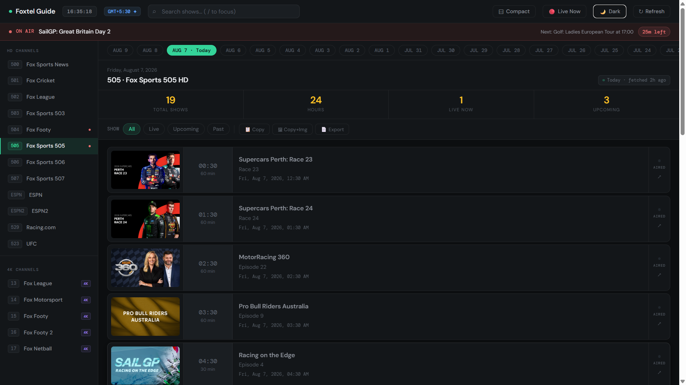
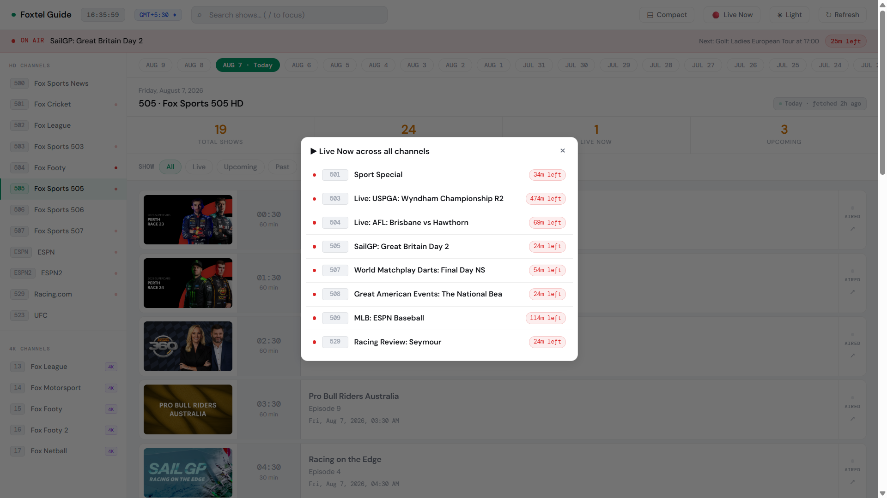
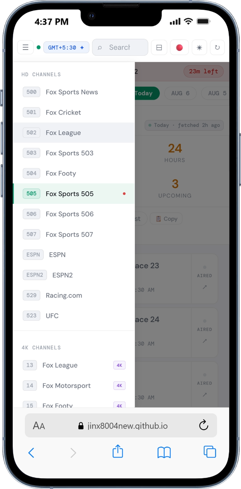
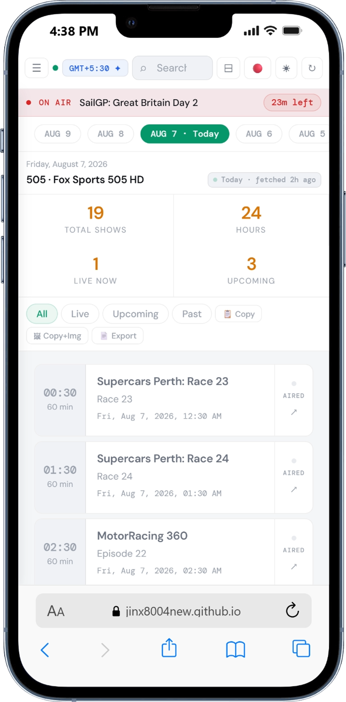

<div align="center">

<h1>Foxtel EPG</h1>

<p><b>A TV guide that remembers yesterday.</b></p>

<p>
<a href="https://github.com/Jinx8004NEW/FoxtelEPG/actions/workflows/fetch-schedule.yml"></a>
<a href="https://github.com/Jinx8004NEW/FoxtelEPG/actions/workflows/deploy-pages.yml"></a>


</p>

<h3><a href="https://jinx8004new.github.io/FoxtelEPG/">Open the guide &rarr;</a></h3>

<br>



<details>
<summary><b>More screenshots</b></summary>
<br>

<p><i>Dark theme</i></p>

<p><i>Live Now, every channel at once</i></p>

&nbsp;

<p><i>Mobile</i></p>
</details>

<br>

<table>
<tr>
<td align="center"><b>17</b><br><sub>channels</sub></td>
<td align="center"><b>21 days</b><br><sub>of history</sub></td>
<td align="center"><b>4 hours</b><br><sub>refresh cycle</sub></td>
<td align="center"><b>0</b><br><sub>servers</sub></td>
</tr>
</table>

</div>

---

## Why this exists

Every TV guide site shows today and the next few days, then quietly drops yesterday. Fine for
planning your evening. Useless if you missed a match on Tuesday and want to know what it was
called so you can go find it.

This one keeps 21 days. That one requirement shaped everything else: history has to live
somewhere, which meant a backend I didn't want to run or pay for. Committing JSON to the repo
turned out to be the whole answer.

**Why every four hours.** Sports schedules aren't fixed. Rain stops a Test, a fixture is
abandoned, and Foxtel replaces the slot with highlights or a repeat within the hour. Fetch once a
day and the guide confidently shows a match that isn't happening. Four hours keeps the drift small
without hammering anyone's API.

<br>

## How it works

```
GitHub Actions (every 4h)
   |
   |-- fetch.js     Foxtel API  ->  12 HD channels x 3 days
   |                DAZN API    ->  5 4K channels, +/-6 days
   |                            ->  data/<TAG>/<date>.json + index.json
   |-- cleanup.js   prune anything older than 21 days
   |-- commit + push
                     |
                     v
        docs/index.html on GitHub Pages
        reads data/*.json over raw.githubusercontent.com
```

Neither Foxtel nor DAZN sends CORS headers, so the browser can't call them at all. Once you're
fetching server-side anyway, git is a perfectly good database: free, versioned, CDN-backed, and
the history comes for nothing. The page itself never talks to an API.

<br>

## What you get

|  |  |
| :---: | --- |
| 🕐 | Times in **your** timezone, with an override if you'd rather read it as Sydney sees it |
| 🔴 | Live tracking: on-air bar, progress bars, countdowns, a dot on whichever channel is broadcasting |
| 📺 | **Live Now** modal, all 17 channels at once |
| 📅 | 21 days back. Ahead: 2 days HD, 6 days 4K |
| 🔍 | Search with highlighting, plus all / live / upcoming / past filters |
| 📋 | Copy or download the day as text, or push a programme to Google Calendar |
| 🌙 | Dark and light themes, compact density, proper mobile layout |
| 🔗 | Shareable URLs: `?ch=FAF&date=2026-08-07` |

<kbd>/</kbd> search &nbsp; <kbd>&larr;</kbd> <kbd>&rarr;</kbd> day &nbsp; <kbd>L</kbd> jump to live &nbsp; <kbd>C</kbd> compact &nbsp; <kbd>N</kbd> Live Now &nbsp; <kbd>Esc</kbd> close

<br>

## Channels

<details>
<summary><b>12 HD</b> &nbsp;<i>Foxtel web EPG</i></summary>
<br>

| Tag | Channel | No. | | Tag | Channel | No. |
| --- | --- | --- | --- | --- | --- | --- |
| `FSN` | Fox Sports News | 500 | | `FSS` | Fox Sports 507 | 507 |
| `FS1` | Fox Cricket | 501 | | `ESP` | ESPN | 508 |
| `SP2` | Fox League | 502 | | `ES2` | ESPN2 | 509 |
| `FS3` | Fox Sports 503 | 503 | | `UFC` | Main Event UFC | 523 |
| `FAF` | Fox Footy | 504 | | `RTV` | Racing.com | 529 |
| `FSP` | Fox Sports 505 | 505 | | | | |
| `SPS` | Fox Sports 506 | 506 | | | | |

</details>

<details>
<summary><b>5 4K</b> &nbsp;<i>DAZN / Kayo EPG</i></summary>
<br>

| Tag | Channel | Sport |
| --- | --- | --- |
| `4KL` | Fox League 4K | NRL, NRL Women |
| `4KF1` | Fox Motorsport 4K | F1, V8 Supercars, MotoGP |
| `4KF` | Fox Footy 4K | AFL |
| `4KF2` | Fox Footy 2 4K | AFL overflow |
| `4KN` | Fox Netball 4K | Suncorp Super Netball |

These only broadcast around fixtures, so long empty stretches are normal, not a bug.

</details>

<br>

## Things that bit me

**Cricket isn't 4K just because the provider says so.** DAZN routes `fsa501` to Fox League 4K and
I trusted it. But only Australia men's home matches are actually broadcast in 4K, so the guide
filled up with 4K cricket that never existed. Now an event needs an explicit `is4k` flag unless
it's a competition that's always 4K anyway (AFL, F1, Super Netball).

**Programmes vanished around midnight.** The day-bounded Foxtel query drops events sitting right
on the boundary. Today is now fetched twice, bounded and unbounded, and merged on `eventId`.

**Storage dates and display dates are different things.** Files are bucketed in IST. The frontend
re-buckets by timestamp into your timezone, so one file can feed two days on screen. The date
pills are *derived from* the file list, never equal to it.

**The two collectors are copy-pasted on purpose.** `fetch.js` runs unattended; `backfill.js` I run
by hand when I've broken something. Sharing helpers means a debugging session can take down the
scheduled job. I'd rather fix the same bug twice.

<br>

## Layout

```
.github/workflows/     fetch (every 4h), backfill (manual), pages deploy (manual)
docs/index.html        the entire frontend, one file
scripts/fetch.js       scheduled collector, HD + 4K
scripts/backfill.js    manual historical collector
scripts/cleanup.js     retention
```

Node 20+, one dependency, no build step. The frontend is one HTML file with inline CSS and JS,
which is either the best or worst decision here depending on your taste. It loads instantly on
mobile data and I've never waited for a bundler.

> [!IMPORTANT]
> `data/` isn't in the initial commit; the first workflow run creates it. It is deliberately **not**
> gitignored, because the fetch workflow commits it with `git add data/`. Ignore it and the
> pipeline goes green forever while doing nothing.

<details>
<summary><b>A day file, and the settings that fail silently</b></summary>
<br>

```json
{
  "channel": "FSN",
  "date": "2026-08-03",
  "fetchedAt": 1785755938197,
  "events": [
    {
      "eventId": 181615833,
      "programTitle": "FOX SPORTS News",
      "scheduledDate": 1785677400000,
      "duration": 30,
      "episodeTitle": "Sunday 2 August 2026, 23:30.",
      "parentalRating": "NC",
      "imageUrl": "https://images1.resources.foxtel.com.au/store2/mount1/16/4/okdfp8.jpg"
    }
  ]
}
```

`scheduledDate` is epoch ms, `duration` is minutes. Every timezone decision in the frontend comes
from those two. 4K events get a trimmed version of the same shape.

Actions needs **read and write** permissions, or the fetch works and only the push 403s. Pages
source must be **GitHub Actions**, not a branch. `PROXY_*` secrets are DAZN only, since their
endpoint is geo-blocked and GitHub's runners aren't always somewhere it likes; Foxtel doesn't need
them.

**Adding a channel** means four edits: `CHANNELS` in `fetch.js` and `backfill.js`, the tag list in
`cleanup.js` (forget this and its files never get pruned), and the `CHANNELS` object plus sidebar
markup in `docs/index.html`.

</details>

<br>

---

<div align="center">
<sub>

No license. Schedule data belongs to Foxtel and DAZN, pulled slowly from their public endpoints
for personal use. Images are hotlinked from their CDNs.

</sub>
</div>
